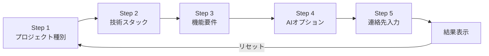

# 見積もりシミュレーター 仕様書

## 1. 概要

AI受託開発の概算費用を、ユーザーが質問に回答するだけで算出するウィザード形式のシミュレーター。  
最終ステップで連絡先を入力させる「リード獲得型」設計。

- **ルート**: `/estimate`
- **UI形式**: 1画面1質問のウィザード（全5ステップ）
- **状態管理**: Zustand (`useEstimationStore`)
- **アニメーション**: Framer Motion（横スライド遷移 / カウントアップ）

---

## 2. ユーザーフロー



- Step 1〜2: **単一選択**（`single`）
- Step 3〜4: **複数選択**（`multiple`）
- Step 5: 連絡先フォーム（react-hook-form + zod バリデーション）
- 結果表示: 概算金額 + 選択内容の内訳

---

## 3. 金額算出ロジック

### 基本方針
- **Next.js / Supabase 構成を標準（¥0）** とし、外注技術や追加機能に応じて加算する方式。
- 合計金額 = 各ステップの選択肢の `price` を単純合算。

### Step 1: プロジェクト種別（単一選択）

| ID | 選択肢 | 加算額 |
|----|--------|--------|
| `web-app` | Webアプリケーション | ¥0 |
| `mobile-app` | モバイルアプリ | +¥300,000 |
| `ai-system` | AI / 機械学習システム | +¥500,000 |
| `api-backend` | API / バックエンド | +¥200,000 |

### Step 2: 技術スタック（単一選択）

| ID | 選択肢 | 加算額 |
|----|--------|--------|
| `nextjs-supabase` | Next.js + Supabase（標準） | ¥0 |
| `react-node` | React + Node.js | +¥100,000 |
| `php-laravel` | PHP / Laravel（外注技術） | +¥300,000 |
| `python-django` | Python / Django | +¥200,000 |

### Step 3: 機能要件（複数選択）

| ID | 選択肢 | 加算額 |
|----|--------|--------|
| `auth` | 認証・ユーザー管理 | +¥200,000 |
| `payment` | 決済機能（Stripe連携） | +¥350,000 |
| `dashboard` | 管理ダッシュボード | +¥400,000 |
| `chat` | チャット・メッセージ | +¥300,000 |
| `notification` | 通知機能 | +¥150,000 |
| `file-upload` | ファイルアップロード | +¥200,000 |

### Step 4: AI機能オプション（複数選択）

| ID | 選択肢 | 加算額 |
|----|--------|--------|
| `rag` | RAG構築 | +¥800,000 |
| `chatbot` | AIチャットボット | +¥500,000 |
| `image-recognition` | 画像認識・OCR | +¥600,000 |
| `voice` | 音声認識・合成 | +¥500,000 |

### 金額例

| ケース | 構成 | 合計 |
|--------|------|------|
| 最小構成 | Web + Next.js/Supabase | ¥0 |
| 標準Web | Web + Next.js/Supabase + 認証 + ダッシュボード | ¥600,000 |
| AI付きWeb | AI + Python + 認証 + RAG + チャットボット | ¥2,200,000 |
| フル構成 | AI + PHP + 認証 + 決済 + ダッシュボード + RAG + チャットボット | ¥3,150,000 |

---

## 4. Step 5: 連絡先フォーム

### 入力項目

| フィールド | 必須 | バリデーション |
|-----------|------|---------------|
| お名前 | ✅ | 1文字以上 |
| メールアドレス | ✅ | メール形式 |
| 会社名 | - | なし |
| 補足メッセージ | - | なし |

- バリデーション: `zod` スキーマ + `react-hook-form` で即時表示
- 送信後: `isCompleted = true` となり結果画面へ遷移

---

## 5. UI仕様

### プログレスバー
- 画面上部にステップ番号（`n / 5`）とプログレスバーを表示
- 右上に概算費用をリアルタイム表示

### カード選択UI
- 各選択肢はカード形式で2カラム Grid 表示
- 選択状態: ボーダー色変化（`border-primary`）+ チェックマークアニメーション
- 価格表示: 加算額 or 「標準」ラベル

### アニメーション
| 対象 | アニメーション | 詳細 |
|------|-------------|------|
| ステップ遷移 | 横スライド | Spring (stiffness: 300, damping: 30) |
| カード選択 | 拡大/縮小 | whileHover: scale 1.02 / whileTap: scale 0.98 |
| チェックマーク | ポップイン | initial scale 0 → animate scale 1 |
| 金額表示 | カウントアップ | easeOutCubic, 600ms |
| 結果画面 | フェードイン | opacity + scale 0.95 → 1 |

### ナビゲーション
- 「戻る」ボタン: Step 1 では `disabled`
- 「次へ」ボタン: 選択が1つ以上あるときのみ有効
- Step 4 → Step 5: ボタンテキストが「連絡先入力へ」に変化

---

## 6. 結果画面

- チェックアイコンのポップインアニメーション
- 概算金額の表示（カウントアップアニメーション付き）
- 選択内容の内訳一覧（ステップ別にグループ化）
- アクション:
  - 「もう一度見積もる」 → ストアをリセットしStep 1へ
  - 「トップに戻る」 → `/` へ遷移

---

## 7. ポートフォリオ連携（計画中）

ポートフォリオの詳細モーダルから「この実績をベースに見積もり」ボタンを押すと、URLクエリパラメータで初期値を引き継ぐ。

```
/estimate?projectType=ai-system&techStack=nextjs-supabase&features=auth,chat&aiFeatures=rag,chatbot
```

| パラメータ | 対応Step | 値 |
|-----------|---------|-----|
| `projectType` | Step 1 | option ID |
| `techStack` | Step 2 | option ID |
| `features` | Step 3 | カンマ区切りの option ID |
| `aiFeatures` | Step 4 | カンマ区切りの option ID |

> ※ URLパラメータの読み取り・ストアへの反映ロジックは未実装。

---

## 8. ファイル構成

```
src/
├── app/estimate/
│   └── page.tsx              # ウィザードメインページ
├── components/estimate/
│   ├── StepCard.tsx          # ステップカード（スライドアニメーション）
│   ├── OptionCard.tsx        # 個別選択肢カード
│   ├── PriceSummary.tsx      # リアルタイム金額表示
│   ├── ContactForm.tsx       # 連絡先入力フォーム
│   └── ResultView.tsx        # 結果・内訳表示
├── store/
│   └── estimationStore.ts    # Zustand ストア
└── data/
    └── estimationData.ts     # ステップ定義・価格データ
```

---

## 9. 型定義

```typescript
interface EstimationOption {
  id: string;
  label: string;
  description: string;
  price: number;
  icon?: string;
}

interface EstimationStep {
  id: string;
  title: string;
  subtitle: string;
  type: "single" | "multiple";
  options: EstimationOption[];
}
```

---

## 10. 今後の拡張予定

- [ ] ポートフォリオからのURLパラメータ初期値反映
- [ ] Supabaseへの見積もりデータ保存（リード管理）
- [ ] メール自動送信（連絡先入力後のサンクスメール）
- [ ] 見積書PDF出力
- [ ] 管理画面でのステップ・価格設定の動的管理
